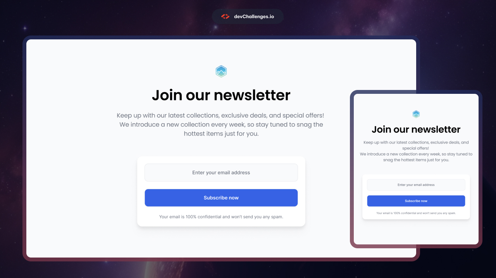

# Join Our Newsletter

## Overview

This project is a responsive newsletter sign-up page built as part of a devChallenges.io challenge. The goal was to create a visually appealing and mobile-friendly landing page where users can subscribe to a newsletter. The design closely follows the provided mockups and emphasizes accessibility and responsiveness.

## What I learned

- How to structure semantic HTML for accessibility and SEO.
- Responsive design techniques using CSS Flexbox and media queries.
- Styling form elements and customizing placeholder text.
- Best practices for organizing CSS for maintainability.
- Importance of meta tags for SEO and mobile optimization.

## Useful resources

- [MDN Web Docs - Responsive Design](https://developer.mozilla.org/en-US/docs/Learn/CSS/CSS_layout/Responsive_Design)
- [CSS Tricks - Centering in CSS](https://css-tricks.com/centering-css-complete-guide/)
- [Google SEO Starter Guide](https://developers.google.com/search/docs/fundamentals/seo-starter-guide)
- [devChallenges.io Community](https://github.com/orgs/devchallenges-io/discussions)

## Built with

- HTML5
- CSS3 (Flexbox, Media Queries)
- [devChallenges.io](https://devchallenges.io/) assets

## Features

- Responsive layout for desktop, tablet, and mobile devices
- Centered and styled email input placeholder
- Accessible form elements
- SEO-friendly meta tags
- Clean and modern design

## Contact

- GitHub: [Daniel Pombo](https://github.com/DanielPomboDev)

## Acknowledgements

- [devChallenges.io](https://devchallenges.io/) for the challenge and assets
- [MDN Web Docs](https://developer.mozilla.org/) for documentation
- [CSS Tricks](https://css-tricks.com/) for CSS tips and guides
